<!-- HERO SECTION -->

  <h1><strong>Thangamani A</strong></h1>
  <h3><strong>AI Engineer | Data Analyst</strong></h3>

  
<i>
  Final-year B.Tech Artificial Intelligence & Data Science student focused on
  AI/ML, Generative AI, Computer Vision, Data Analytics and full-stack development.
  </i>

  

    
    
    
    
  

  

 

<!-- TOP CARDS -->
<table>
  <tr>
    <td valign="top"></td>
    <td valign="top"></td>
  </tr>
</table>

  

---

## 🚀 About Me

<table width="100%">
<tr>
<td width="55%" valign="top">

### 👨‍💻 Who am I?

- 🎓 **B.Tech Artificial Intelligence & Data Science (2023–2027)**
  — The Kavery Engineering College
- 📊 **CGPA: 7.73**
- 📍 Pennagaram, Tamil Nadu, India
- 🤖 Interested in **Artificial Intelligence, Machine Learning, Deep Learning and Generative AI**
- 👁️ Building practical solutions using **Computer Vision and OpenCV**
- 📈 Working with **Data Analytics, Power BI, Tableau, Python and SQL**
- 🌐 Full-stack exposure with **React, Node.js, NestJS and FastAPI**
- 🛠️ Comfortable with **Git, GitHub, Linux and REST APIs**

> *"I don't just write code. I build practical solutions that solve real-world problems."*

</td>

<td width="45%" align="center" valign="middle">

</td>
</tr>
</table>

---

## 🏆 Competitive Programming

  

| LeetCode Metric | Result |
|---|---:|
| 🟢 Easy | **61** |
| 🟡 Medium | **9** |
| 🔴 Hard | **0** |
| ✅ Acceptance | **92.94%** |
| 📤 Submissions | **85** |
| 📅 Active Days | **7** |
| 🔥 Max Streak | **4** |
| 🏅 Rank | **2,400,156** |

---

## 🏅 Achievements & Activities

- 🎯 **Code Debugging Achievement** — Kavery Engineering College
- 💻 **Code Debugging Achievement** — Srinivasa Engineering College
- 🤖 Participated in a **Generative AI Workshop**
- 📜 Certifications and practical work related to **AI/ML & Data Analytics**
- 🧠 Built projects involving **AI assistants, computer vision, data analytics and web development**

---

## 💼 Internship Experience

### 🏢 BeautO Private Limited — ThinkWrites Publishing Platform

**Role:** Frontend Developer Intern / Backend Developer Intern  
**Duration:** 3 Months

- Developed frontend features using **HTML5, CSS3, JavaScript and TypeScript**
- Worked with backend technologies including **Node.js and NestJS**
- Worked with **SQL, PostgreSQL and MySQL**
- Implemented and worked with **JWT-based authentication**
- Gained practical exposure to full-stack application development

---

## ⚡ Tech Stack & Engineering Arsenal

### 💻 Programming & Web

  

### 🤖 Artificial Intelligence

  

**Artificial Intelligence • Machine Learning • Deep Learning • Generative AI • Computer Vision • OpenCV**

### 📊 Data & Analytics

**Data Analytics • SQL • Power BI • Tableau • Data Visualization**

### 🛠️ Backend, APIs & Tools

  

**REST API • Node.js • NestJS • FastAPI • PostgreSQL • Git • GitHub • Linux • Figma • Electron**

---

## 💼 Featured Projects

<table width="100%">
<tr>
<td width="50%" valign="top">

### 🤖 Hey Bro AI Assistant

Voice-based AI assistant for automation, application control, web search, system commands and intelligent responses.

**Tech:** Python • Speech Recognition • pyttsx3 • OpenCV • PyAutoGUI • Requests • Ollama / LLM

</td>

<td width="50%" valign="top">

### 🧠 CRO AI Assistant

Intelligent AI assistant combining voice interaction, automation, AI chat and computer vision capabilities.

**Tech:** Python • FastAPI • React • Electron • Tailwind CSS • OpenAI/Gemini/Ollama • SQLite/PostgreSQL

</td>
</tr>

<tr>
<td width="50%" valign="top">

### 👁️ Face Recognition Attendance System

Computer-vision based system for recognizing faces and managing attendance.

**Tech:** Python • OpenCV • Face Recognition • Computer Vision

</td>

<td width="50%" valign="top">

### 📊 Student Performance Analysis

Data analysis project focused on understanding student performance and generating useful insights.

**Tech:** Python • SQL • Data Analytics • Tableau • Power BI

</td>
</tr>

<tr>
<td width="50%" valign="top">

### 🌐 Personal Portfolio Website

Modern personal portfolio showcasing skills, projects, education and career profile.

**Tech:** HTML • CSS • JavaScript • UI/UX

</td>

<td width="50%" valign="top">

### 🚀 AI Engineering Focus

Building practical solutions across AI assistants, automation, computer vision, analytics and web applications.

**Focus:** AI/ML • GenAI • Computer Vision • Data Analytics • Full Stack

</td>
</tr>
</table>

---

## 🎯 Current Focus

- 🤖 Building **AI-powered applications**
- 🧠 Exploring **Generative AI and LLM-based systems**
- 👁️ Developing **Computer Vision** solutions
- 📊 Improving **Data Analytics & Visualization** skills
- 🌐 Building practical **full-stack applications**
- 💻 Strengthening **problem-solving and competitive programming**

---

## 📜 Certifications & Learning

**Data Analytics • Cybersecurity • Machine Learning • Generative AI • Python • MongoDB • Full Stack Development**

---

## 📍 Professional Snapshot

  <b>AI Engineer</b> •
  <b>AI & Data Science</b> •
  <b>Machine Learning</b> •
  <b>Generative AI</b> •
  <b>Computer Vision</b> •
  <b>Data Analytics</b> •
  <b>Full Stack</b>

---

## 📈 GitHub Analytics & Open Source Activity

  

  
  

  

  

  

---

## 🤝 Let's Connect

<a href="mailto:thangamani2389@gmail.com">📧 Email</a> •
<a href="https://www.linkedin.com/in/mani-ms-7108132a3/">💼 LinkedIn</a> •
<a href="https://github.com/MANI2389">🐙 GitHub</a> •
<a href="https://leetcode.com/u/thangamani-A/">🧩 LeetCode</a>

  

**Open to AI Engineer, Software Engineer and Data/AI opportunities.**

---

